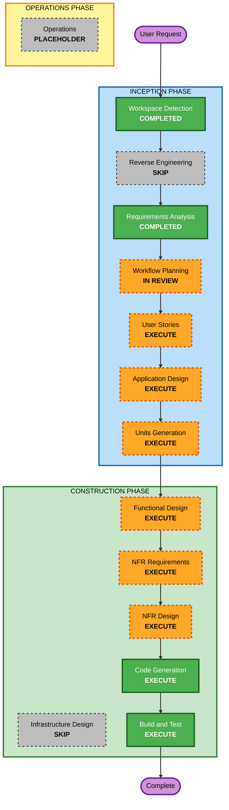

# Execution Plan

## Detailed Analysis Summary

### Change Impact Assessment

- **User-facing changes**: Yes. Customer ordering flow and admin operations dashboard are both user-facing.
- **Structural changes**: Yes. A new Next.js application with frontend routes, API routes, SQLite persistence, and SSE streaming is required.
- **Data model changes**: Yes. The MVP needs schemas for stores, tables, table sessions, menus, orders, order items, and order history.
- **API changes**: Yes. New backend API routes are required for login, menus, cart/order submission, order status updates, table sessions, history, and SSE events.
- **NFR impact**: Yes. Realtime updates, local persistence, PBT, resiliency decisions, health/error behavior, and build/test instructions are required.

### Risk Assessment

- **Risk Level**: Medium
- **Rollback Complexity**: Moderate
- **Testing Complexity**: Moderate to Complex

Rationale: The work is a greenfield MVP, but it spans UI, API, persistence, realtime streaming, session lifecycle behavior, and test strategy.

## Workflow Visualization

### Text Alternative

1. Workspace Detection: completed.
2. Reverse Engineering: skipped because this is a greenfield project with no existing application code.
3. Requirements Analysis: completed and approved.
4. Workflow Planning: created and awaiting review.
5. User Stories: execute because customer and admin workflows need acceptance criteria.
6. Application Design: execute because components, services, API boundaries, and business rules must be defined.
7. Units Generation: execute because the project should be decomposed into data/API/customer/admin/testing units.
8. Functional Design: execute for data model, order/session lifecycle, cart/order calculations, and state transitions.
9. NFR Requirements: execute because PBT and resiliency extensions are enabled and realtime behavior is required.
10. NFR Design: execute to incorporate PBT, resiliency, health/error handling, SSE reconnect behavior, and backup/rollback documentation.
11. Infrastructure Design: skip for MVP implementation because no cloud infrastructure resources are being provisioned in this workspace.
12. Code Generation: execute.
13. Build and Test: execute.
14. Operations: placeholder.

## Phases to Execute

### INCEPTION PHASE

- [x] Workspace Detection - COMPLETED
- [x] Reverse Engineering - SKIPPED
  - **Rationale**: Greenfield workspace; no existing application code.
- [x] Requirements Analysis - COMPLETED
- [x] Workflow Planning - IN REVIEW
- [ ] User Stories - EXECUTE
  - **Rationale**: Customer and admin workflows require acceptance criteria and personas.
- [ ] Application Design - EXECUTE
  - **Rationale**: New components, API routes, data access, SSE behavior, and business rules need design.
- [ ] Units Generation - EXECUTE
  - **Rationale**: Work should be decomposed into manageable units covering foundation, customer flow, admin flow, realtime behavior, and testing.

### CONSTRUCTION PHASE

- [ ] Functional Design - EXECUTE
  - **Rationale**: Data schemas, cart totals, order lifecycle, table session transitions, and history movement require detailed design.
- [ ] NFR Requirements - EXECUTE
  - **Rationale**: PBT and Resiliency Baseline are enabled; realtime and reliability requirements must be captured.
- [ ] NFR Design - EXECUTE
  - **Rationale**: The implementation must include concrete patterns for SSE reconnects, structured errors, seed logging, and testing reproducibility.
- [ ] Infrastructure Design - SKIP
  - **Rationale**: The MVP is implemented locally in the workspace without provisioning cloud infrastructure.
- [ ] Code Generation - EXECUTE
  - **Rationale**: Implementation planning and code generation are required.
- [ ] Build and Test - EXECUTE
  - **Rationale**: Build instructions, unit tests, integration tests, PBT execution, and verification are required.

### OPERATIONS PHASE

- [ ] Operations - PLACEHOLDER
  - **Rationale**: Future deployment and monitoring workflows.

## Estimated Timeline

- **Total stages to execute after approval**: 8
- **Expected depth**: Standard, with detailed PBT and resiliency handling where applicable

## Success Criteria

- Working Next.js table-order MVP is generated in the workspace root.
- SQLite persists stores, tables, sessions, menus, orders, order items, and order history.
- Customer flow supports table auto-login, menu browsing, cart management, order creation, and current session history.
- Admin flow supports login, SSE order monitoring, order status updates, table session completion, order deletion, history lookup, and menu management.
- Example-based tests cover critical business scenarios.
- Property-based tests cover applicable cart/order calculations, state transitions, data transformations, and serialization/persistence transformations.
- Build and test instructions document normal test execution, PBT seed handling, and local verification.

## Extension Compliance

### Property-Based Testing

- **PBT-01**: Applicable in Functional Design; planned.
- **PBT-02 through PBT-08**: Applicable during Code Generation where matching transformations and stateful logic exist; planned.
- **PBT-09**: Compliant. `fast-check` selected for TypeScript.
- **PBT-10**: Compliant. Plan requires example-based tests and PBT.

### Resiliency

- **RESILIENCY-01 through RESILIENCY-04**: Compliant at planning level; decisions from requirements are carried forward.
- **RESILIENCY-05 through RESILIENCY-15**: Planned for applicable downstream design/build-test stages, with local MVP constraints documented where full production implementation is not applicable.

